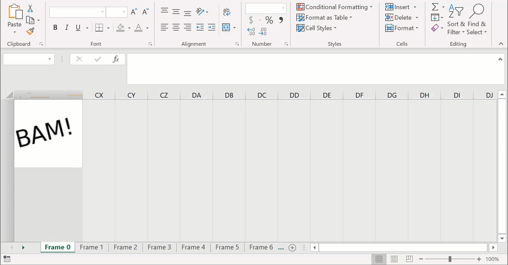

# gif_to_excel
Command line app for turning an animated gif into an animated Excel macro spreadsheet (xlsm). For security reasons Excel won't run the auto play macro if you open the resulting xlsm file in preview mode and you will have to enable vba/macros to see the animation.

The application itself is ridiculous but the purpose is to inspire other Python coders to check out what is possible using xlsxwriter and the pillow packages.

## See example output below

### A simple animated gif


### The same animated gif converted to an auto-playing Excel macro spreadsheet (xlsm)



## Usage

```shell
gif_to_excel.py <input_file> <output_file> --column-width=<column_width <column_width> --row-height=<row_height>
```

* input_file is the path to the animated gif to convert
* output_file is the path to the xlsm file to save
* column_width is the width to make the columns in the xlsm file (defaults to 0.1 if not specified)
* row_height is the height to make the rows in the xlsm file (defaults to 1 if ot specified)

gif_to_excel.py is a command line application with two required parameters and two optional parameters.

e.g.

```shell
python gif_to_excel.py example/bam.gif bam.xlsm
```

or with the optional parameters specified:

```shell
python gif_to_excel.py example/bam.gif bigger_bam.xlsm --column-width=0.4 --row-height=4
```